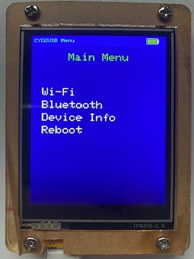
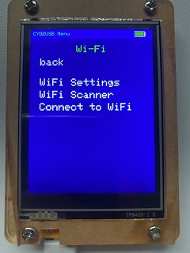
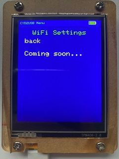
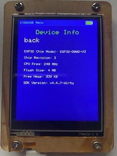
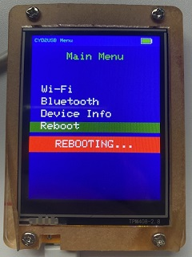
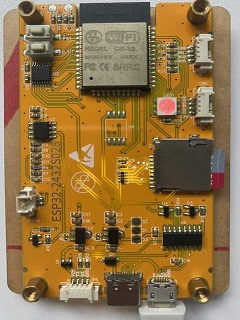

# CYD2USB Menu

- A simplified ESP32 Marauder Menu UI clone for ESP32-2432S028R 2.8" Display ESP32 development board, standard 2.8-inch TFT screen and resistor TP, with XPT2046 touch controller (CYD2USB)

   
   

## Features

- Easy-to-use menu interface with touch screen
- Simple configuration options for expanding Menu

## Requirements
 
 - ESP32-2432S028R 2.8" Display ESP32 development board (CYD2USB)
 - VS Code/PlatformIO
 - C compiler (gcc recommended)

## Assumptions

- Arduino ESP32 Development

## Contributing

- Contributions are welcome! If you'd like to contribute to this project, please fork the repository and submit a pull request with your changes.

## License

Copyright (c) 2026 G.E. Eidsness

Licensed under the Apache License, Version 2.0 (the "License");
you may not use this file except in compliance with the License.
You may obtain a copy of the License at

    http://www.apache.org/licenses/LICENSE-2.0

Unless required by applicable law or agreed to in writing, software
distributed under the License is distributed on an "AS IS" BASIS,
